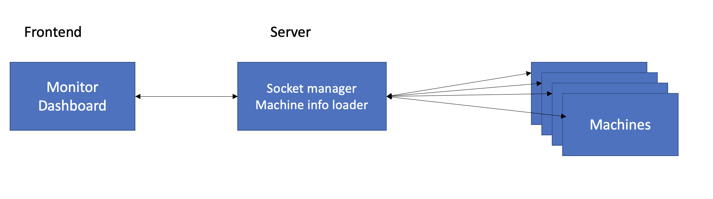

# MacCpuMonitor

A web based CPU load average monitor dashboard with nestjs and angular.

## Dev

This is a monorepo of nestjs and angular.

If you want to run it:

1. Make sure you have `npm` `nx` installed since it's a nx workspace.
2. Run `npm install` to install packages. (if you get error when install cypress, make sure you disable the proxy an the security software such like: zscaler);
3. Start server by : `npm run serve`.
4. Start client by: `npm run dev`.
5. Go to browsr with `localhost:3000`.

There exists also the code coverage check command:
Run `npm run coverage` then you can check the report under coverage folder. 
In this project, code coverage is not fully handled. It should be greater than 80% in production to make sure code quality.

There exists one e2e test for notifications:

1. Make sure the app is running and the port is 3000 because e2e test using the url `localhost:3000`
2. Run `npm run e2e:angular`

It's a simple e2e test using the existing app without mock any backend request or websocket.

## Main features

1. a nestjs lib to expose cpu load average with rest api and a websocket to update realtime cpu load
2. a nestjs server to host the web app and connect with other servers's cpu load info configured in .env
3. on frontend, user can get all the server machine's info and it's realtime cpu load(per 10 seconds).
4. frontend dashboard contains a banner to indicate current status and a chart with history data, a activities list generated by the realtime cpu load.

## Architecture

As the project is used to monitor cpu load. And we would like to trace the info in a small time interval like 10s. The websocket will be a better solution for this case.(low-latency/high frenquence/real time update).

Here is the overal architecture:

Frontend will only know the api from a central server which knows all machines to monitor with a config in [.env](./.env).

Server is built with nestjs. It expose three api:

- Get `/servers`: to get all machines to monitor.
- Get `/server/id` : to get more info from the machine.
- Websocke `/monitor` : for frontend to create websocket to subscribe the realtime cpu load. Server will take responsibilty to comunicate with all machines and give update to frontend.

To help server communicate with the target machines. We provide a lib `cpu-rest-api` which is a nestjs plugin. If we want to monitor any machine just start the nestjs server and include this lib into its `AppModule` then server can call the api provided by this lib:

- Get `/cpu-monitor/server-info`: to get current machine info details.
- Websocket `/cpu-load`: to give the current machine's real time cpu load to servers.

## Script Command in package.json

`dev`: start a watch to angular project.
`serve`: start a watch to nestjs server.
`format`: format all your code.
`coverage`: get a report of code coverage => to be done.
